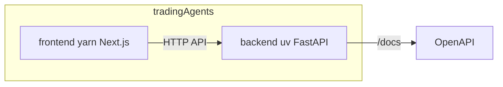

# Trading Agents

前後端分離嘅 Trading Agents 專案：Backend API（FastAPI + LangChain）配 Next.js 前端。

## 技術棧

- **Backend**：Python 3.11+、FastAPI、LangChain、DeepSeek、uvicorn；套件管理用 **uv**
- **Frontend**：Next.js 16、React 19、TypeScript、Tailwind；套件管理用 **yarn**

## 編程風格

前後端都以 **函數式編程** 為主：純函數、少可變狀態、組合優於繼承；Backend 用純函數處理業務邏輯，Frontend 用函數組件與 custom hooks，避免 class component 與隱藏副作用。詳見 [.cursor/rules/functional-programming.mdc](.cursor/rules/functional-programming.mdc)。

## 前置需求

- [Python 3.11+](https://www.python.org/)
- [uv](https://docs.astral.sh/uv/)（Backend 依賴管理）
- [Node.js](https://nodejs.org/)
- [yarn](https://yarnpkg.com/)（Frontend 依賴管理）

## 目錄結構

| 目錄 | 職責 |
|------|------|
| `backend/` | FastAPI API、LangChain 邏輯，用 uv 管理 Python 依賴 |
| `frontend/` | Next.js 應用，用 yarn 管理 Node 依賴 |

## 架構示意



## 環境變數

Backend 需要嘅環境變數請參考 [backend/.env.example](backend/.env.example)。複製為 `.env` 後填入：

- `OPENAI_API_KEY`（如使用 OpenAI）
- `DEEPSEEK_API_KEY`（如使用 DeepSeek）

## 安裝與執行

### Backend

```bash
cd backend
uv sync
uv run main.py
```

或：`uv run python main.py`。API 預設喺 `http://0.0.0.0:8000`。

### Frontend

```bash
cd frontend
yarn
yarn dev
```

開發伺服器預設喺 [http://localhost:3000](http://localhost:3000)。建置與生產啟動：`yarn build`、`yarn start`。

## API 文件

Backend 啟動後可訪問：

- **Swagger UI**：`http://localhost:8000/docs`
- **ReDoc**：`http://localhost:8000/redoc`
